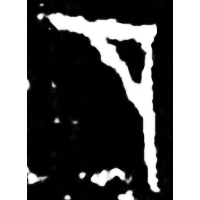
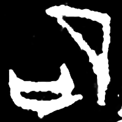
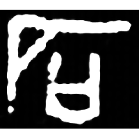
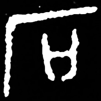
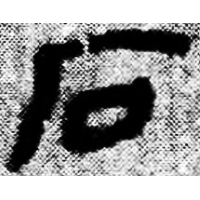
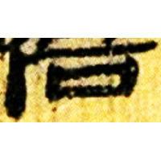
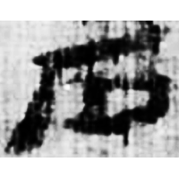
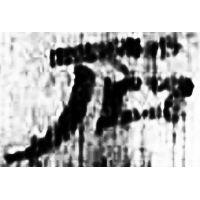
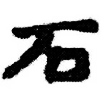

+++
radical = "112"
weight = 1
+++

| Shang (Shi-Bin) | Shang (Bin) | Shang (Huadong) | Middle W.Zhou | Qin | W.Han | E.Han | E.Han | E.Han | Nanbei (N.Wei) |
| ----- | ----- | ----- | ----- | ----- | ----- | ----- | ----- | ----- | ----- |
|  |  |  |  |  |  |  |  |  |  |
| 英1846 | 合6952正 | 花473 [砋] | 集3977 | 睡.效22 | 北.淫Z2 [磨] | 五.楬350B | 五.行306 | 文物2002.12 | 南0282X |

{石} \*dak "stone"

Initially the word {石} was written as [厂](https://panatesu.github.io/glyph-origins/radicals/27/#U%2b5382)² (depiction of a stone chime). Later differentiative element 口 was added.

- 季旭昇 2014 - 說文新證 \[2nd ed.\] (727)
