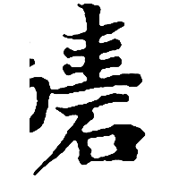
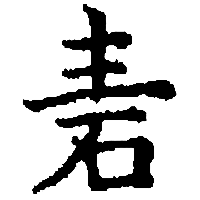
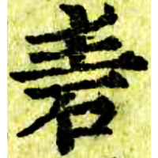

+++
radical = "112"
weight = 1
+++

| Nanbei (Liang) | Nanbei (Liang) | N.Song | Ming | Qing |
| ----- | ----- | ----- | ----- | ----- |
|  |  |  |  |  |
| 玉篇 [騞] | 玉篇 | 廣韻 | 洪武正韻 | 內本康熙 |

{砉} \*qʷʰˤek "*crackling sound*"

[石](https://panatesu.github.io/glyph-origins/radicals/112/#U%2b77F3) *STONE* + ♪[圭](https://panatesu.github.io/glyph-origins/radicals/32/#U%2b572D) \*KᵂE (\> 丰/丯).

- 布之道 2022 - 廣韻形聲考
