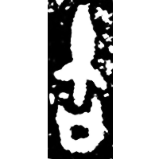
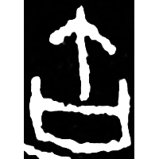
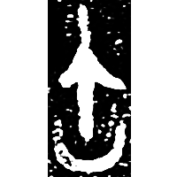
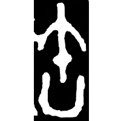
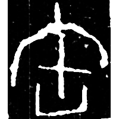
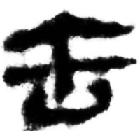
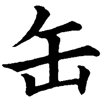

+++
radical = "121"
weight = 1
+++

| Shang | Shang (Bin) | Early W.Zhou | Late W.Zhou | Chunqiu (Qin) | Qin | W.Han | W.Han | Tang |
| ----- | ----- | ----- | ----- | ----- | ----- | ----- | ----- | ----- |
|  |  |  |  |  |  |  |  |  |
| 集5339.1 [寶] | 合3061正 | 集5997 | 集4065.2 [寶] | 石鼓.吾車 [𩢿] | 陶錄6.325.2 | 馬.易21下 | 北.蒼15 [䍍] | 五經文字 |

{缶} \*p(r)uʔ "earthen pot for storing alcohol"

♪[午](https://panatesu.github.io/glyph-origins/radicals/24/#U%2b5348)² \*PU (depiction of a drumstick for {枹/桴} \*\[b\](r)u "drumstick") + differentiative 口.

- 復旦大學出土文獻與古文字研究中心 (ed.) 2024 - 出土文獻與古文字教程 (11-12)
