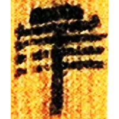
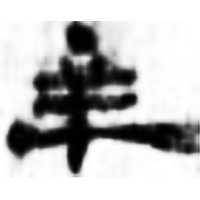
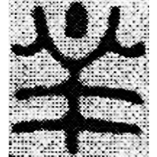
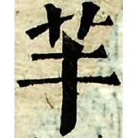

+++
radical = "123"
weight = 1
+++

| W.Han | Han | Han | Tang | Ming | Qing |
| ----- | ----- | ----- | ----- | ----- | ----- |
|  |  |  |  |  |  |
| 北.蒼38 | 玉Ⅱ98DYT1:28 | 共15頁 | 五經文字 | 字彙 | 內本康熙 |

{羋} \*meʔ "baa *(the bleating of a sheep)*"

Sheep ([羊](https://panatesu.github.io/glyph-origins/radicals/123/#U%2b7F8A)) with a dot/line over it, representing the sound coming from it.

- 李學勤 (ed.) 2012 - 字源 (317)
