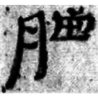
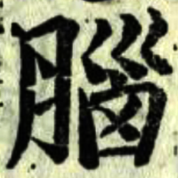

+++
radical = "130"
weight = 1
+++

| Han | Jin | Tang | Ming |
| ----- | ----- | ----- | ----- |
|  |  |  |  |
| 敦667 | 黃庭內景經 | 五經文字 | 洪武正韻 |

{腦} \*nˤ\[u\]ʔ "brain"

[肉](https://panatesu.github.io/glyph-origins/radicals/130/#U%2b8089) *FLESH* + ♪[𡿺](https://panatesu.github.io/glyph-origins/radicals/47/#U%2b21FFA) \*NU.
