+++
radical = "114"
weight = 1
+++

| Shang | Shang (Shi-Bin) | Shang (Bin) | Early W.Zhou | Middle W.Zhou | Late W.Zhou | Qin | Qin | Han | W.Jin | Tang | Ming |
| ----- | ----- | ----- | ----- | ----- | ----- | ----- | ----- | ----- | ----- | ----- | ----- |
| 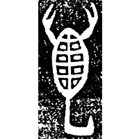 | 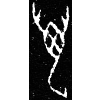 | 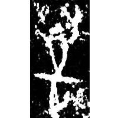 | 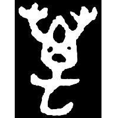 | 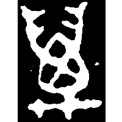 |  | 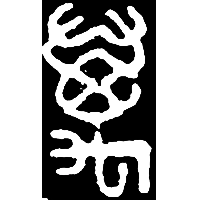 | 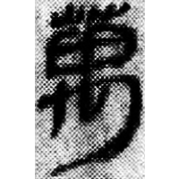 | 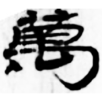 | 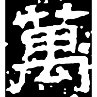 | 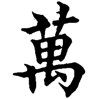 | 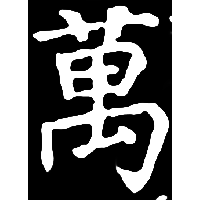 |
| 集6680 [蠆] | 合9812 [蠆] | 英150正 | 集3745 | 集4252.1 | 集4555 | 璽彙4493 | 里耶8-552 | 敦176 | 晉祀后土碑 | 五經文字 | 明0399X |

{一萬} \*ʔit tV.ma\[r\]s "one myriad" → {萬} \*tV.ma\[r\]s "myriad"

Initially the word {萬} was written phonetically with a glyph created for the word {蠆} \*məC̥.rˤa\[t\]s "scorpion" (depiction of a scorpion) (cf. its usage as ♪萬 \*RAT in e.g. [厲](https://panatesu.github.io/glyph-origins/radicals/27/#U%2b53B2) for {礪} \*rats "whetstone"). The glyph [一](https://panatesu.github.io/glyph-origins/radicals/1/#U%2b4E00) "one" was added to represent the compound {一萬}, giving the ligature 萬. Later this ligature began to be used for the morpheme {萬} itself.

- 張秉權 1975 - 甲骨文中所見的「數」

**Forms:**

[万](https://panatesu.github.io/glyph-origins/radicals/1/#U%2b4E07) - Shortening based on the early cursive form. Modern simplified form　in China and Japan.
