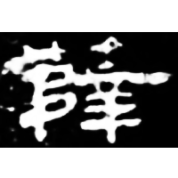
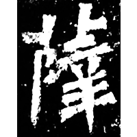
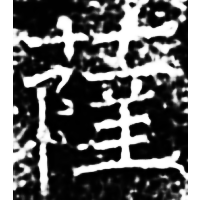
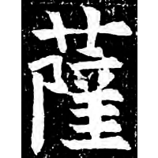
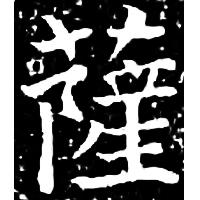
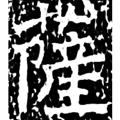
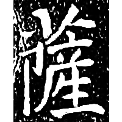
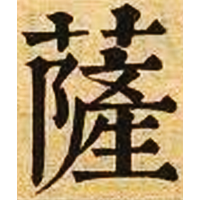

+++
radical = "140"
weight = 1
+++

| E.Han | Nanbei (N.Wei) | Nanbei (E.Wei) | Tang | Jin | Ming | Qing | Qing |
| ----- | ----- | ----- | ----- | ----- | ----- | ----- | ----- |
|  |  |  |  |  |  |  |  |
| 孔宙碑 [薛] | 南0060X [薛] | 南0445A | 唐1303A | 宋0400X | 明0134X | 清0015B | 內本康熙 |

{(菩)薩} *(bu)sat* "bodhisattva"

Assimilated form of  from 薛埵 \*siat.tuɑjᴮ "sattva" via adding  from  to the bottom right. The appearence of  "to live" (\> 產) in the bottom right part is probably influenced by Sanskrit *sat* "existing; living".

- 岩松浅夫 1991 - 「薩」字の成立とその變遷
- 張涌泉 2010 - 漢語俗字研究 \[2nd ed.\] (180)
