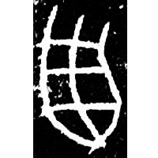
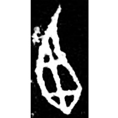
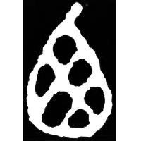
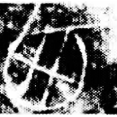
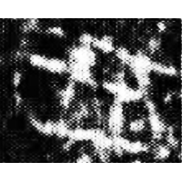
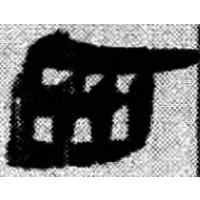
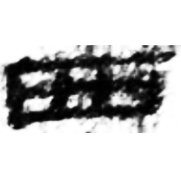
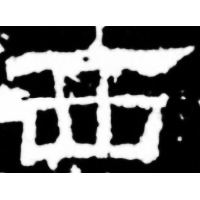
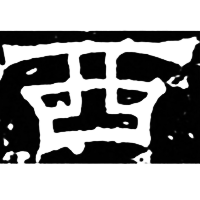
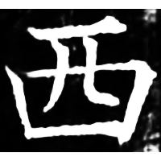

+++
radical = "146"
weight = 1
+++

| Shang (Bin) | Shang (Bin) | Middle W.Zhou | Chunqiu (Qin) | Chunqiu (Qin) | Zhanguo (Qin) | Qin | W.Han | E.Han | Sanguo (Wei) | Tang |
| ----- | ----- | ----- | ----- | ----- | ----- | ----- | ----- | ----- | ----- | ----- |
|  |  |  |  |  |  |  |  |  |  |  |
| 合7097正 | 合9744 | 集4289.1 | 石鼓.吳人 | 集4315 | 集11405 | 睡.日乙163 | 北.淫34 | 熹經418 | 曹真殘碑陽 | 開石.周易1 |

?{西} \*sV.nˤər "west"

Unknown.

- 季旭昇 2014 - 說文新證 \[2nd ed.\] (831-832)
