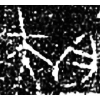
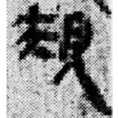
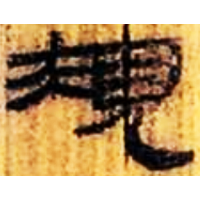
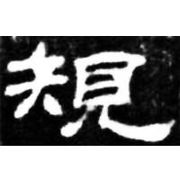
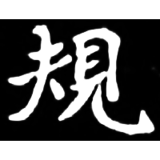

+++
radical = "147"
weight = 1
+++

| Zhanguo (Qin) | Qin | W.Han | E.Han | Nanbei (N.Wei) |
| ----- | ----- | ----- | ----- | ----- |
|  |  |  |  |  |
| 集11405.1 [鬹] | 里耶8-1437背 | 北.老27 | 孔龢碑 | 南0241X |

{規} \*kʷe "compass"

Shortened form of [𭑌](https://panatesu.github.io/glyph-origins/radicals/37/#U%2b2D44C) (depiction of a person holding a carpenter's square for {矩} \*kʷ(r)aʔ "carpenter's square") + probably shortened form of ♪[𧠹](https://panatesu.github.io/glyph-origins/radicals/147/#U%2b27839) \*KᵂE ([⿱目人](https://panatesu.github.io/glyph-origins/radicals/215/#%E2%BF%B1%E7%9B%AE%E4%BA%BA) *LOOK* (\> 見) + ♪[圭](https://panatesu.github.io/glyph-origins/radicals/32/#U%2b572D) \*KᵂE for {窺} \*kʷʰe "to peep").

陳劍 2015 - 說“規”等字並論一些特別的形聲字意符
