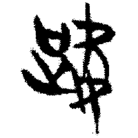
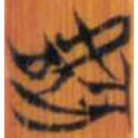
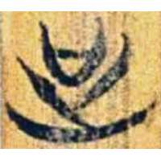
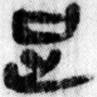
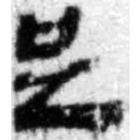
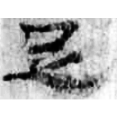
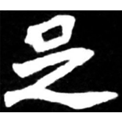
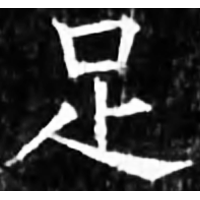

+++
radical = "157"
weight = 1
+++

| Chunqiu (Jin) | Zhanguo (Chu) | Zhanguo (Chu) | Qin | W.Han | E.Han | Nanbei (N.Wei) | Tang |
| ----- | ----- | ----- | ----- | ----- | ----- | ----- | ----- |
|  |  |  |  |  |  |  |  |
| 侯馬3:23 [𧿞] | 清六.鄭武17 [𧿞] | 上四.曹沫15 | 睡.封69 | 張.引67 | 五.行400 | 元懷墓誌 | 開石.儀禮8 |

{足} \*\[ts\]ok "to fulfill" / {足} \*\[ts\]ok "foot"

Shortened form of [𧿞](https://panatesu.github.io/glyph-origins/radicals/157/#U%2b27FDE) ([吹](https://panatesu.github.io/glyph-origins/radicals/30/#U%2b5439)³ + decorative [止](https://panatesu.github.io/glyph-origins/radicals/77/#U%2b6B62)).

- 陳聞達 2024 - 說“足”字的形體來源兼論相關問題
