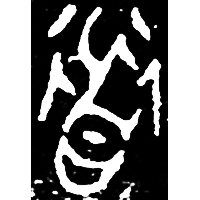
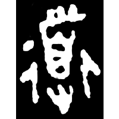
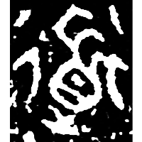
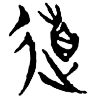
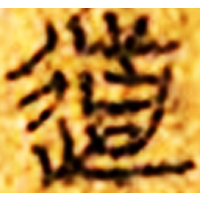
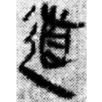

+++
radical = "162"
weight = 1
+++

| Early W.Zhou | Middle W.Zhou | Late W.Zhou | Chunqiu (Jin) | Zhanguo (Qin) | Qin | W.Han | E.Han | Nanbei (N.Wei) |
| ----- | ----- | ----- | ----- | ----- | ----- | ----- | ----- | ----- |
|  |  |  |  |  |  |  |  |  |
| 集5409.1 | 近二439 | 集10176 | 侯馬3:26 | 青川木牘 | 里耶8-573 | 北.老122 | 張遷碑 | 元洛神墓誌 |

{道} \*\[kə.l\]ˤuʔ "way"

[辵](https://panatesu.github.io/glyph-origins/radicals/162/#U%2b8FB5) *MOVE* + ♪[首](https://panatesu.github.io/glyph-origins/radicals/185/#U%2b9996) \*LU.

- 黃德寬 (ed.) 2007 - 古文字譜系疏證 (535-536)
