+++
radical = "167"
weight = 1
+++

| Shang (Huadong) | Shang (Chu) | Early W.Zhou | Early W.Zhou | Early W.Zhou | Late W.Zhou | Chunqiu (Qin) | Qin | Qin | W.Han | E.Han | Tang |
| ----- | ----- | ----- | ----- | ----- | ----- | ----- | ----- | ----- | ----- | ----- | ----- |
| 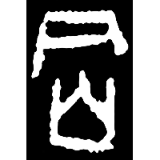 | 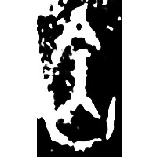 | 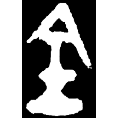 | 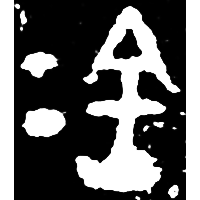 | 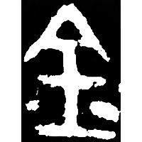 | 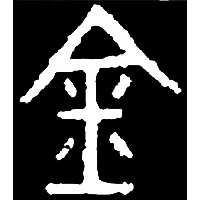 | 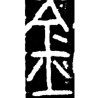 | 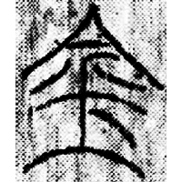 | 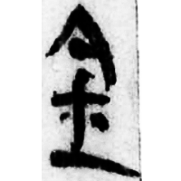 | 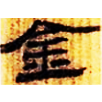 | 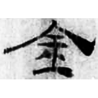 | 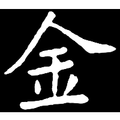 |
| 花478 [⿱今火] | 合23573 [⿱今火] | 集3790 [⿱今火] | 集4131 | 集9901 | 集4235.2 | 集證84 [鎗] | 里耶8-1776 | 睡.日甲90背 | 北.老143 | 五.行379 | 南0237A |

{金} \*k(r)um "bronze"

Initially the word {金} was written as  ( *FIRE +* ♪ \*KUM). Later  *METAL* was added.

- 黃天樹 2005 - 花園莊東地甲骨中所見的若干新資料
- 季旭昇 2014 - 說文新證 \[2nd ed.\] (925-926)

**Forms:**

 - Shortening based on the cursive form in the left part of compound glyphs. Modern simplified form in China.
