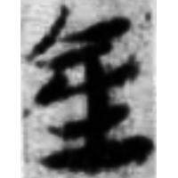
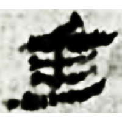
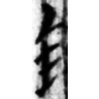
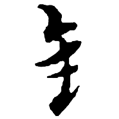

+++
radical = "167"
weight = 1
+++

| Han | Han | Han | Yuan |
| ----- | ----- | ----- | ----- |
|  |  |  |  |
| 武醫52 | 肩73EJT4:101 | 居舊128.37 [鍉] | 趙孟頫 [錄] |

Shortening of  based on the cursive form in the left part of compound glyphs. Modern simplified form of  in China.

- Bökset R. 2021 - Long Story of Short Forms: Simplified Chinese Characters from A to Z (163-164)
