+++
radical = "176"
weight = 1
+++

| Shang (Huadong) | Middle W.Zhou | Middle W.Zhou | Zhanguo (Chu) | Zhanguo (Qi) | Qin | W.Han | W.Han | Han | Han | E.Han | Nanbei (N.Wei) |
| ----- | ----- | ----- | ----- | ----- | ----- | ----- | ----- | ----- | ----- | ----- | ----- |
| 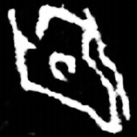 | 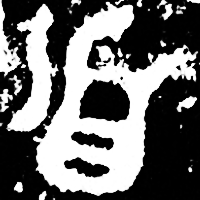 | 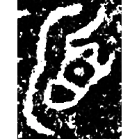 | 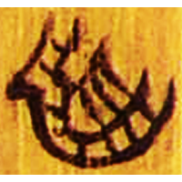 | 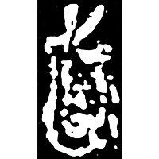 | 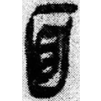 | 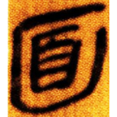 | 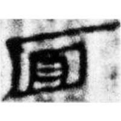 | 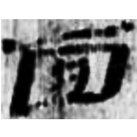 | 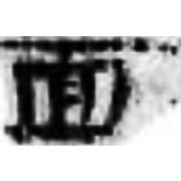 | 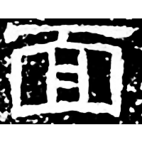 | 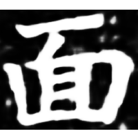 |
| 花113 | 集2831 [⿸产面] | 集9897.1 [𬍵] | 清四.筮法46 | 錄遺6.132 | 睡.日甲69背 | 張.漢338 | 武.少牢14 | 敦683 | 肩72ECC:25 | 西狹頌 | 南0357X |

{面} \*CV.me\[n\]s "face"

Depiction of a head ([首](https://panatesu.github.io/glyph-origins/radicals/185/#U%2b9996)) with an indicative line over the face.

- 黃天樹 2005 - 花園莊東地甲骨中所見的若干新資料
- 謝明文 2016 - 說“𥆞”及其相關之字
