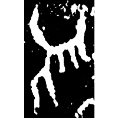
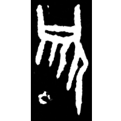
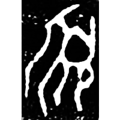
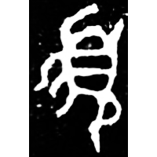
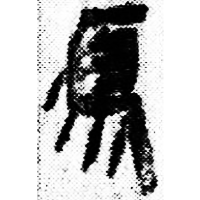
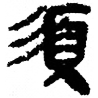
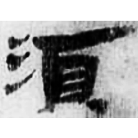
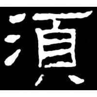
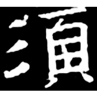

+++
radical = "181"
weight = 1
+++

| Shang (Bin) | Shang (Bin) | Middle W.Zhou | Late W.Zhou | Qin | Qin | E.Han | W.Jin | Nanbei (N.Zhou) | Tang |
| ----- | ----- | ----- | ----- | ----- | ----- | ----- | ----- | ----- | ----- |
|  |  |  |  |  |  |  |  |  |  |
| 合816反 | 懷819 | 集4416 | 集4368.1 | 睡.日甲71反 | 睡.爲41 | 五.木牘294A | 徐義墓誌 | 十六佛名號 | 五經文字 |

{鬚} \*C\[sV.n\]o "beard" ♪→ {須/䇓} \*\[sV.n\]o "to wait"

Depiction of a person with a beard.

- 季旭昇 2014 - 說文新證 \[2nd ed.\] (703)
