+++
radical = "187"
weight = 1
+++

| Shang | Shang (Shi) | Shang (Bin) | Shang (Wuming) | Early W.Zhou | Middle W.Zhou | Late W.Zhou | Chunqiu (Qin) | Qin | W.Han | Han | Nanbei (N.Qi) |
| ----- | ----- | ----- | ----- | ----- | ----- | ----- | ----- | ----- | ----- | ----- | ----- |
| 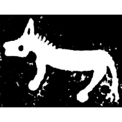 |  | 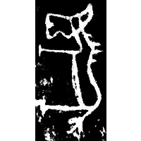 | 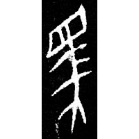 | 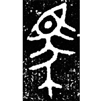 | 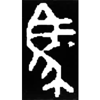 | 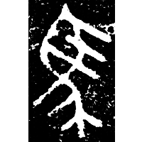 | 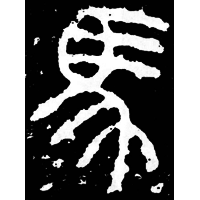 | 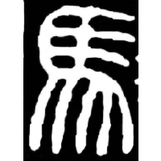 | 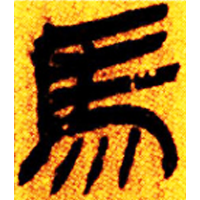 | 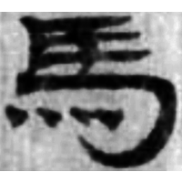 | 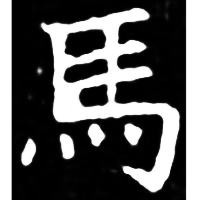 |
| 集10857.1 | 合19813正 | 合11446 | 合27966 | 集2612 | 歷文2006(3) | 集4318.1 | 石鼓.馬薦 | 秦印編192 [駕] | 張.功120 | 敦177 | 竇泰墓誌 |

{馬} \*mˤraʔ "horse"

Depiction of a horse.

- 季旭昇 2014 - 說文新證 \[2nd ed.\] (741-742)

**Forms:**

[马](https://panatesu.github.io/glyph-origins/radicals/187/#U%2b9A6C) - Shortening based on the cursive form. Modern simplified form in China.
