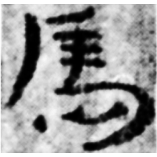
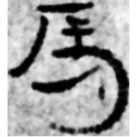
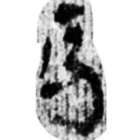
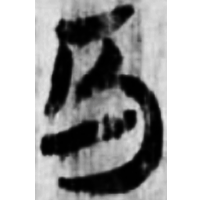
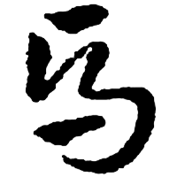
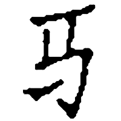

+++
radical = "187"
weight = 1
+++

| Han | Han | Han | Han | Sanguo (Wu) | Yuan |
| ----- | ----- | ----- | ----- | ----- | ----- |
|  |  |  |  |  |  |
| 居新EPT68:22 | 居新EPF22:197 | 敦233A | 敦173 | 松本急就章 | 西蜀夢 [駈] |

Shortening of [馬](https://panatesu.github.io/glyph-origins/radicals/187/#U%2b99AC) based on the cursive form. Modern simplified form of [馬](https://panatesu.github.io/glyph-origins/radicals/187/#U%2b99AC) in China.

- Bökset R. 2021 - Long Story of Short Forms: Simplified Chinese Characters from A to Z (212)

  
