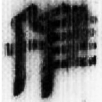

+++
radical = "196"
weight = 1
+++

| W.Han | Tang |
| ----- | ----- |
|  |  |
| 北.蒼69 [𨾙] | 五經文字 |

{鴇} \*pˤuʔ "bustard"

[鳥](https://panatesu.github.io/glyph-origins/radicals/196/#U%2b9CE5) *BIRD* + ♪[瓜](https://panatesu.github.io/glyph-origins/radicals/97/#U%2b74DC) \*PU.

- 陳劍 2020 - 釋“瓜”
