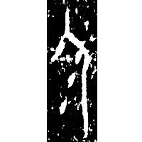
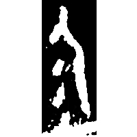
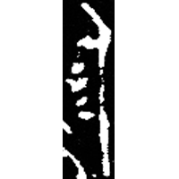
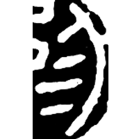
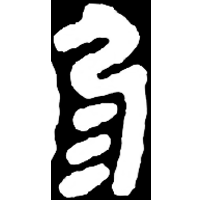

+++
title = "⿹弓彡"
radical = "57"
weight = 0
+++

| Shang (Bin) | Shang (Bin) | Chunqiu (Chu) | Qin | Qin |
| ----- | ----- | ----- | ----- | ----- |
|  |  |  |  |  |
| 合137正 | 合557 | 集261.2 [弱] | 珍秦99 [弱] | 珍展139 [弱] |

{尿/溺} \*kə.nˤewks "to urinate"

Depiction of a urinating person (人). The modern form is a *liding*.

- 謝明文 2017 - 談談甲骨文中可能用作“庭”的一個字
- 鄔可晶 2022 - “弱”、“約”有關字詞的考察
